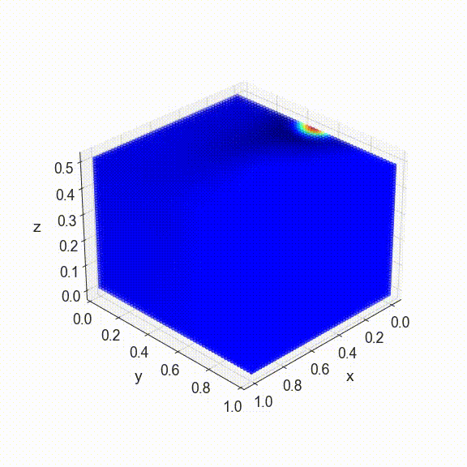
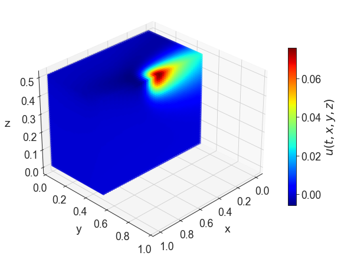
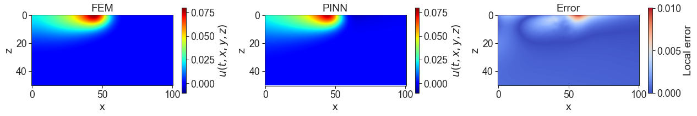

# Physics-Informed-ML
The repository provides a tutorial for the implementation of a physics informed neural network (PINN) to solve a heat conduction problem for a cuboid with an applied heat source. The PINN can be used to model the temperature fields within materials exposed to, e.g. laser irradiation in additive manufacturing. The underlying research question is, if the PINN can sufficiently model the temperature field within the material. 

The repository consists of the following:
- PINN_3D_heat_conduction --> Python code of the Physics-Informed Neural Network (PINN)
- Images (Images and animations)

## Underlying physics
The underlying solved partial differential equation is the heat conduction. The animation shows the partial differential equation for heat conduction, which is rewritten to become a minimization problem.

  
   
  <em>The partial differential equation for heat conduction becomes a minimzation problem.</em>

In the equation u is the temperature field at given time (t) and position (x). The moving heat source is denoted as f(x,t). 
The neural network approximates the function u and the loss function in the PINN is defined by taking the derivatives from u with respect to time and space to minimize the shown equation. By adding initial conditions and boundary conditions to the loss function, the physical problem is sufficiently described and the solution is approximated by the neural network. 

## Results
The animation shows the calculation of the PINN and the moving heat source for the calculated time interval. 

  
   
  <em>Animation of the moving heat source and calcuted heat conduction by the PINN.</em>

The temperature field at t=0.5 along the cross section of the laser path can be seen. The heat conduction show an expected behavior and the mean absolute error for the whole domain is 0.00078. 

  
   
  <em>The cut along the laser path shows the heat conduction in the material modeled by the PINN.</em>

The highest local difference between the solution from the PINN and FEM is 0.01 at the surface in front of the heat source. However, this larger difference only occurs at a comparably small region. In the remaining part, the PINN show good agreement to the FEM. 

  
   
  <em>The 2D cross section along the laser path shows an accurate temperature field comparing a solution from FEM with those from the PINN.</em>

## Citing this repository
Please cite the publication when using the repository:
- Voigt and Moeckel, 'Physic informed neural networks for heat conduction modeling in material processing and production'

